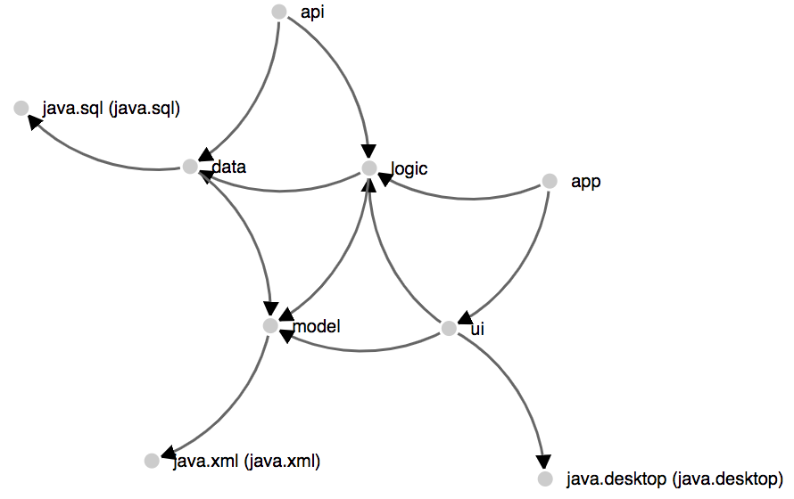

# d3-dot-graph

This module provides [D3js][d3js] compatible library to parse and load files in graphviz [DOT (.dot)][dot] (graph description language) format.

## why?
While working on [Java Platform Module System][jpms] migration projects coming with Java 9 (as of August 2017), I am havily using [jdeps][jdeps] which is generating [DOT (.dot)][dot] files. These are usually visualized using dot tool of [graphviz][graphviz].

In most cases it is enough, but I wanted to have nicer d3js visualization and interaction.

## example    

See sample `summary.dot` file generated by [jdeps][jdeps] visualized using [D3js][d3js] here: [index.html][example]

{ width=50% }

Inspired by Mike Bostosck's [Mobile Patent Suits][mbostock]

## usage

```js
d3.dot(url, callback);
```

Usage is identical with well known `d3.json([url], [callback])` or `d3.csv([url], [callback])`.

```html
<script src="https://cdn.jsdelivr.net/gh/gmamaladze/d3-dot-graph@1.0.0/build/d3-dot-graph.min.js"></script>
<script>

d3.dot("/path/to/graph.dot", function(error, graph) {
  if (error) throw error;
  console.log(JSON.stringify(graph, null, true));
  //{
  //  "nodes": [ {"id": "Myriel"}, {"id": "Napoleon"}],
  //  "links": [ {"source": "Myriel"}, {"target": "Napoleon"}]
  //}  
});

</script>
```

## parser

The parser was generated using [PEG.js][pegjs]. The grammer is taken from here [cpettitt/graphlib-dot](https://github.com/cpettitt/graphlib-dot). Thanks to Chris Pettitt.

You can also use parser independently from loader and converter.

## build

```shell
npm install     #install dependencies and build
npm run build   #generate parser, and rollup

rollup -c -w (rollup --config --watch) #very convenient rolls the whenever sources are changed
```


[d3js]: https://www.d3js.org
[dot]: https://en.wikipedia.org/wiki/DOT_(graph_description_language)
[pegjs]: https://pegjs.org
[jpms]: http://openjdk.java.net/projects/jigsaw/spec/sotms
[jdeps]: https://docs.oracle.com/javase/9/tools/jdeps.htm
[graphviz]: http://www.graphviz.org
[mbostock]: http://bl.ocks.org/mbostock/1153292
[example]: https://cdn.rawgit.com/gmamaladze/d3-dot-graph/cf08847e/example/index.html
